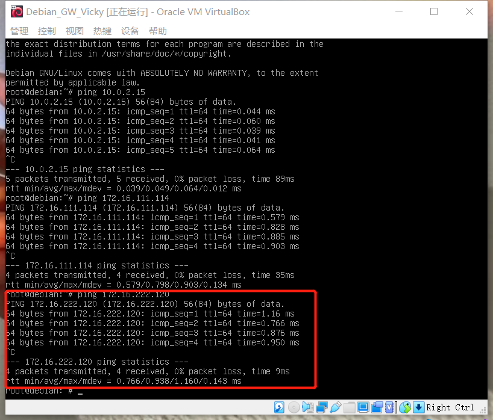
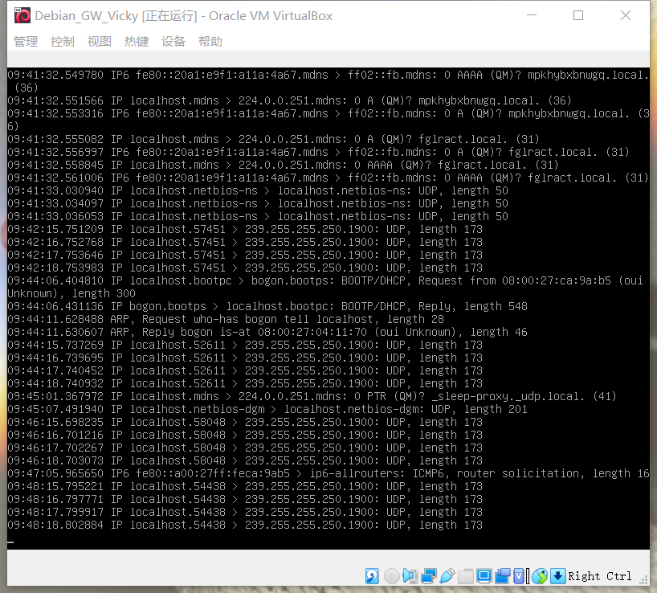
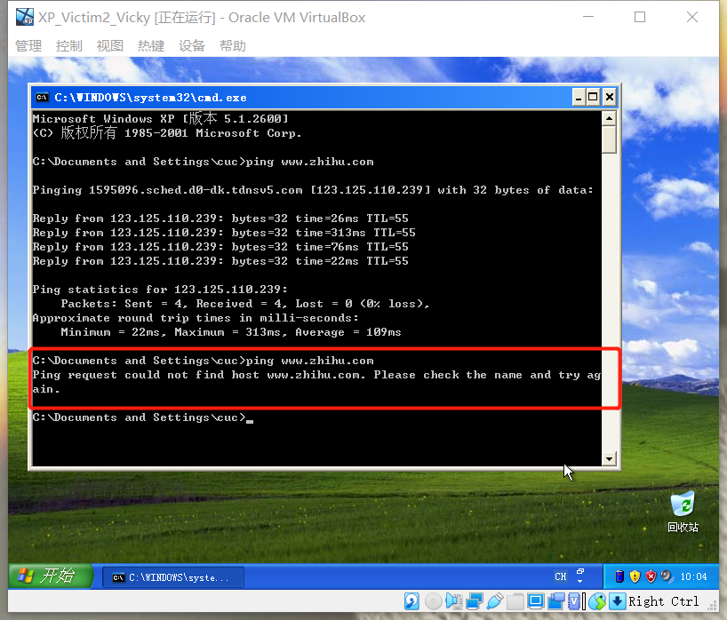

# 基于VirtualBox的网络攻防基础环境搭建


## 实验目的

- 掌握VirtualBox虚拟机的安装与使用；
- 掌握VirtualBox的虚拟网络类型和按需配置；
- 掌握VirtualBox的虚拟硬盘多重加载；


## 实验环境

以下是本次实验需要使用的网络节点说明和主要软件举例：

- VirtualBox虚拟机
- 攻击主机（Attacker)：Kali Rolling 2021.2
- 网关（Gateway,GW）：Debian Buster
- 靶机（Victim）：From Sqli to shell / xp-sp3 / Kali


## 实验要求

- 虚拟硬盘配置成多重加载，效果如下图所示；
- 搭建满足如下拓扑图所示的虚拟机网络拓扑；
- 完成以下网络连通性测试；
  - [x] 靶机可以直接访问攻击者主机
  - [x] 攻击者主机无法直接访问靶机
  - [x] 网关可以直接访问攻击者主机和靶机
  - [x] 靶机的所有对外上下行流量必须经过网关
  - [x] 所有节点均可以访问互联网


## 实验过程——环境搭建

1. 虚拟机实现多重加载

   在虚拟介质管理器中选中盘片，选择多重加载，新建时直接使用多重加载的镜像文件

   

   

2. 各个虚拟机的安装

   

   

   3. 按照拓扑图进行网络配置

      


- 网关（Debian_Gateway）配置

  - 在VirtualBox的主机网络管理器中添加网络，并启用DHCP服务器
  - 四块网卡分别为‘NAT' 'Host-Only' 

  

  

  

  

  - 查看各个网卡的地址，可以发现，四块网卡都被分配到了IP地址

  

  

  

- 靶机配置

  - XP靶机需要将网络改为拓扑图对应的内部网络，将控制芯片改成`Intel Pro/1000T 服务器`。XP的网卡驱动不支持默认芯片。

  - Debian和Kali靶机也将网络改为拓扑图对应的内部网络。

    

    

    

    
    
    - dnsmasq安装
    
      `apt update && apt install dnsmasq`
    
      

- 查看当前IP

  

  

  

  

  

- 整出各个虚拟机对应的IP地址

  | 虚拟机名称          | IP地址                                |
  | ------------------- | :------------------------------------ |
  | Kali_Attacker_Vicky | 10.0.2.15/24（NATNetwork）            |
  | Kali_Victim_Vicky   | 172.16.111.114/24（内部网络 intnet1） |
  | XP_Victim1_Vicky    | 172.16.111.145/24（内部网络 intnet1） |
  | XP_Victim2_Vicky    | 172.16.222.114/24（内部网络 intnet2） |
  | Debian_Victim_Vicky | 172.16.222.120/24（内部网络 intnet2） |
  | Debian_GW_Vicky     | 10.0.2.15/24 （NATNetwork）           |
  |                     | 192.168.56.113/24 （Host Only）       |
  |                     | 172.16.111.1/24（内部网络 intnet1）   |
  |                     | 172.16.222.1/24（内部网络 intnet2）   |

  


## 实验过程——网络连通性测试


- [x] 靶机可以直接访问攻击者主机

  

  

  

  

  

- [x] 攻击者主机无法直接访问靶机

  

- [x] 网关可以直接访问攻击者主机和靶机

  

  

  

- [x] 靶机的所有对外上下行流量必须经过网关

- [x] 所有节点均可以访问互联网

  在网关上安装`tcpdump`，并对对应网卡进行监控。在各个节点上访问互联网，观察捕获到了上下行的包。关闭网关，发现所有节点都无法访问互联网，说明靶机的所有对外上下行流量必须经过网关。

  ```
  apt insatll tcpdump
  /usr/sbin/tcpdump -i enp0s8 # etc
  ```

- 开启网关后





- 关闭网关后

  

  

  

  

  

## 参考资料


[2020-ns-public-LyuLumos](https://github.com/CUCCS/2020-ns-public-LyuLumos)

[第一章 网络安全基础_哔哩哔哩_bilibili](https://www.bilibili.com/video/BV16t4y1i7rz/)

[网络安全 (c4pr1c3.github.io)](https://c4pr1c3.github.io/cuc-ns-ppt/chap0x01.md.html?print-pdf#/title-slide)

